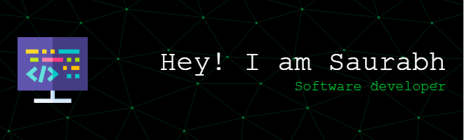

I am a **Software Developer** with experience in building web and mobile applications. Passionate about crafting scalable and user-friendly solutions, I am always eager to learn and contribute to exciting projects.

---

## 👨‍💻 About Me
- 📍 Based in Pune, India
- 💼 Currently a **Software Developer Trainee** at **Senwell Solutions**
- 🎓 Bachelor of Engineering in Computer Science (CGPA: 8.67)
- 🌐 Exploring new technologies and improving my skill set daily

---

## 🛠️ Skills
### Programming Languages

### Frontend Development

### Backend Development

### Mobile Development

### Databases

### Other Skills

---

## 🌐 Socials

---

## 📄 Resume
You can find my resume [here](https://drive.google.com/file/d/1WBFlhrvoVcwcB5vNHsoPBk-DT7lYULu2/view?usp=drivesdk).

---

---

